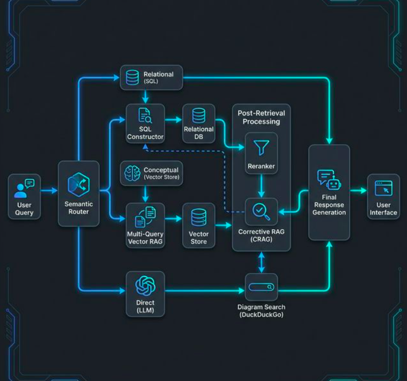

# H2 Economics RAG Chatbot

A powerful, local CPU-only H2 Economics RAG (Retrieval-Augmented Generation) assistant built with LangGraph, Ollama, and Streamlit. This bot intelligently routes between school-specific notes (SQL) and conceptual economics retrieval (Chroma Vector Store), fetching real-time diagrams via DuckDuckGo.

## Quick Start (Local)

### Prerequisites

1. **Python 3.13** and **uv** installed.
2. **Ollama** running locally with the following models:
   - `gemma2:2b` (Main LLM)
   - `dengcao/Qwen3-Reranker-0.6B:Q8_0` (Reranker)
   - `all-minilm:l6-v2` (Embeddings)

### Installation

```bash
# Clone the repository and navigate to the directory
cd econs_data

# Sync dependencies and create virtual environment
uv sync
```

### Running the App

```bash
uv run streamlit run app.py
```

## Architecture



## Dockerization

You can run the application using Docker to ensure a consistent environment.

```bash
# Build and run with Docker Compose
docker compose up --build
```

*Note: The Docker container is configured to connect to Ollama running on your host machine via `host.docker.internal`.*

---

## Evaluation Pipeline

The evaluation pipeline provides comprehensive assessment of RAG response quality using both RAGAS metrics and a Multi-Role Agent Ensemble for LLM-based judging.

### Running Evaluation

```bash
# Run full evaluation (RAGAS + Multi-Role Judge)
.venv/bin/python -m eval.rag_evaluation
```

### Configuration

Evaluation settings are defined in `src/config.py`:

| Parameter | Default | Description |
|-----------|---------|-------------|
| `USE_RAG` | `True` | If `False`, bypasses retrieval entirely (parametric knowledge only) |
| `RERANK` | `True` | If `False`, skips reranking and returns first `TOP_K` docs |
| `TOP_K` | `5` | Number of documents returned to the model |
| `N_FILTER_DOCS` | `10` | Documents passed into reranker |
| `NUM_JUDGES` | `3` | Number of LLM judges (for legacy evaluation) |
| `JUDGE_TEMPERATURE` | `0.7` | Temperature for judge responses |

### Evaluation Components

#### 1. RAGAS Metrics

Automated metrics from the RAGAS framework:

| Metric | Description |
|--------|-------------|
| **Faithfulness** | Does the answer stay grounded in retrieved context? |
| **Answer Correctness** | Alignment with ground truth |
| **Context Precision** | Relevance of retrieved context |
| **Context Recall** | Coverage of relevant information |

#### 2. Multi-Role Agent Ensemble

Three distinct LLM personas evaluate responses with specific rubrics:

##### STUDENT Persona
- **Focus**: Understandability
- **Evaluates**: Language clarity, jargon explanation, step-by-step breakdowns
- **Scoring**: 1-10 (Crystal clear → Incomprehensible)

##### TEACHER Persona
- **Focus**: Correctness & Logic
- **Evaluates**: Causal chains, theoretical soundness, factual accuracy
- **Scoring**: 1-10 (Flawless reasoning → Fundamentally wrong)
- **Critical**: Score < 5 triggers `CRITICAL_FAILURE`

##### EXAMINER Persona
- **Focus**: Singapore Relevance & Evaluation
- **Evaluates**: Singapore-specific constraints (SOE, S$NEER, MPS/CPF), local examples, balanced evaluation
- **Scoring**: 1-10 (Excellent SG context → No SG context)
- **Critical**: Score < 4 triggers `CRITICAL_FAILURE`

### Gatekeeper Logic

Responses are flagged as `CRITICAL_FAILURE` if:

```
TEACHER correctness < 5  OR  EXAMINER singapore_relevance < 4
```

Critical failures result in a weighted score of **0.0**, regardless of other scores.

### Weighted Score Calculation

For non-critical responses:

```
Weighted Score = (Correctness × 0.40) + (Singapore Relevance × 0.35) + (Understandability × 0.25)
```

### Output Files

| File | Description |
|------|-------------|
| `ragas_results.csv` | RAGAS metric scores per query |
| `llm_judge_results.csv` | Multi-role ensemble scores with reasoning |

### Output Columns

The `llm_judge_results.csv` contains:

| Column | Description |
|--------|-------------|
| `query` | Original question |
| `ground_truth` | Expected answer |
| `generated_answer` | RAG system response |
| `understandability` | STUDENT score (1-10) |
| `correctness` | TEACHER score (1-10) |
| `singapore_relevance` | EXAMINER score (1-10) |
| `weighted_score` | Combined weighted score |
| `is_critical_failure` | Boolean flag |
| `failure_reason` | Reason for critical failure |
| `student_reasoning` | STUDENT's evaluation reasoning |
| `teacher_reasoning` | TEACHER's evaluation reasoning |
| `examiner_reasoning` | EXAMINER's evaluation reasoning |

### Latency Evaluation

Separate latency benchmarking is available:

```python
from eval.rag_evaluation import run_latency_evaluation

results = run_latency_evaluation("eval/eval.csv")
```

Measures:
- Embedding time
- Retrieval time (Chroma)
- Reranking time (LLM)
- Total end-to-end latency

---

## Project Structure

```
multiplier/
├── app/
│   └── app.py              # Streamlit UI with streaming feedback
├── src/
│   ├── agent.py            # LangGraph orchestration
│   ├── router.py           # Semantic classification of user intent
│   ├── retrieval.py        # SQL and Vector retrieval handlers
│   ├── crag.py             # Corrective RAG, reranking, diagrams
│   ├── database.py         # SQLite and ChromaDB helpers
│   └── config.py           # Centralized constants
├── eval/
│   └── rag_evaluation.py   # RAGAS + Multi-Role Judge evaluation
├── docs/
│   ├── README.md           # This documentation
│   └── pipeline.png        # Architecture diagram
└── README.md               # Quick start guide
```

## Example Queries to Test

- **Conceptual**: *"Explain the concept of market failure with examples"*
- **School Specific**: *"Show me NYJC 2024 notes on trade"*
- **Comparison**: *"Compare fiscal and monetary policy"*
- **Visuals**: *"Illustrate the welfare loss from a monopoly"* (Triggers diagram search)

## Extending the Evaluation

### Adding New Personas

Add to `JudgePersona` class in `eval/rag_evaluation.py`:

```python
NEW_PERSONA = {
    "name": "NEW_ROLE",
    "system_prompt": "Role description...",
    "focus": "Focus Area",
    "rubric": "Detailed rubric...",
    "output_key": "metric_name",
}
```

### Modifying Gatekeeper Thresholds

Update `apply_gatekeeper_logic()` function:

```python
def apply_gatekeeper_logic(teacher_score: int, examiner_score: int) -> tuple[bool, str]:
    if teacher_score < 5:  # Adjust threshold
        return True, "CRITICAL_FAILURE: ..."
    if examiner_score < 4:  # Adjust threshold
        return True, "CRITICAL_FAILURE: ..."
    return False, "PASSED"
```

### Adjusting Weights

Modify `compute_weighted_score()`:

```python
weighted = (
    correctness * 0.40      # Teacher weight
    + singapore_relevance * 0.35  # Examiner weight
    + understandability * 0.25    # Student weight
)
```
